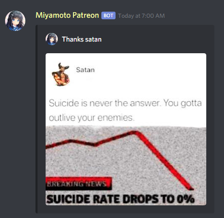
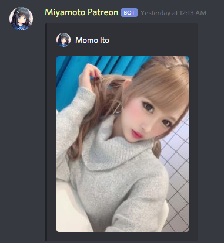

  

# Miyamoto Discord Bot
**Miyamoto is a discord bot that has functions for autoposting of images. We will also continue to add and develop features over time.**

## Pictures Posting
* **Cute Anime**

* **Memes and Shitposting**

* **Korea Idol**

* **Japan Idol**

## Invite
**Just [click this link](https://bit.ly/miyamotobot) and you can add Miyamoto to your server.**

## Features
* **Cute Anime**
* **Lewd Anime**
* **Memes and Shitposting**
* **K-Pop Pictures**
* **Japan Idol Pictures**
* **and more...**

## Setup
**Use `>setup [name]` in the channel to create autopost.**

**Example : `>setup cute`**

## Permissions
**The bot requires certain permissions, which you are prompted for on the invite screen. Each permission has a reason for being required, explained below.**

| **Permission** | **Reason** |
| :---: | :---: |
| **Read messages** | **Detect when you use commands** |
| **Send messages** | **Respond when the bot send autopost** |
| **Embed links** | **Respond when the bot send autopost with embed links** |

## Support
**You don't know how to use bots. Please visit my [support server](https://discord.gg/zGmNyk7).**

## Patreon
**You want to have additional features, Support me on [Patreon](https://www.patreon.com/discordanime).**

## Special Thanks
1. **hanahaneul - Developer ([Github](https://github.com/hanahaneull) - [Website](https://kontol.monster)).**
1. **Ruri - Contributor ([Github](https://github.com/KurokuTetsuya) - [Website](https://fatir.xyz)).**

## Self-hosting
**This code is for reference-only and most of it is not up-to-date. This is not functional and we do not offer any support for self-hosting.**

## License
**[The full license can be found here](https://github.com/AlivaDiscord/Miyamoto/blob/master/LICENSE).**
